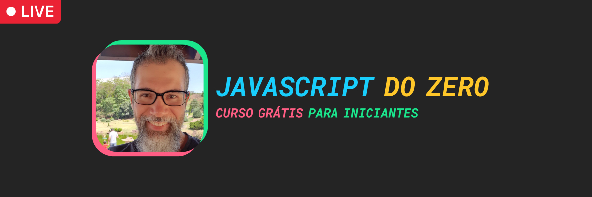

<h1 align="center">
  Exercícios do Curso JS do Zero
</h1>

<h6 align="center">Um curso para quem quer aprender JavaScript do zero. As lives acontecem de segunda à quinta, das 9:15 às 10:15h (horário de Brasília)! Compareça para tirar dúvidas ao vivo =D</h6>
 

<h2 align="center">Link para o curso</h2>

🔗 https://youtube.com/playlist?list=PLpSJMw6H4PFPTcO3pXPi6GBLcX5_8cFJY

---

<h2 align="center">Como baixar este repositório</h2>

Para baixar este repositório em sua máquina, você pode clicar no botão verde "Code" (ali em cima) e fazer download do .zip ou, caso você tenha noções de Git, você pode forká-lo e/ou cloná-lo.
 

---

<h2 align="center">Tem alguma dúvida ou sugestão?</h2>

Envie um email para <a href="mailto:oi@rogermelo.com.br">oi@rogermelo.com.br</a>

